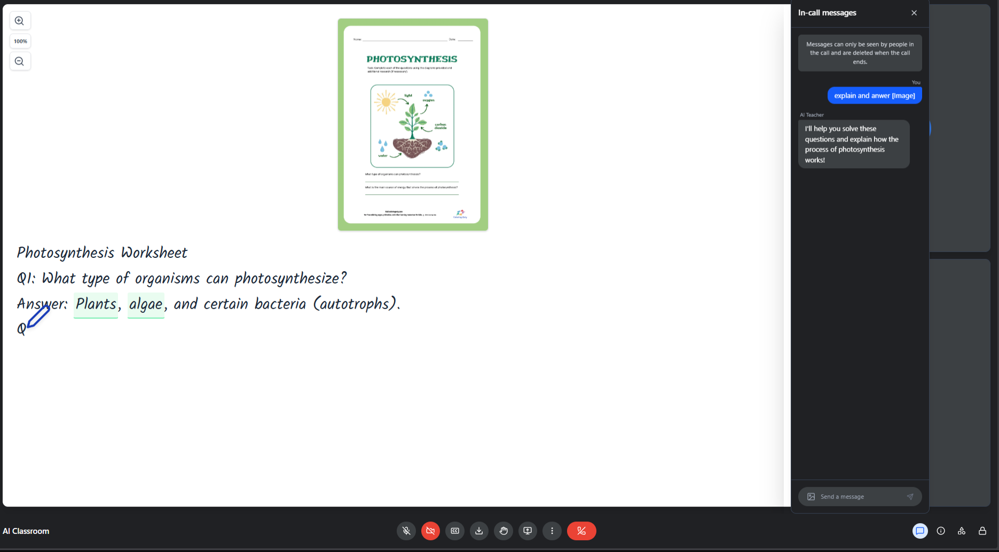

# Meet2AI - Interactive AI Teaching Assistant

An intelligent, real-time classroom platform powered by AI that provides interactive whiteboard explanations, live coding demonstrations, and collaborative learning experiences.



## 🌟 Features

### Core Capabilities
- **AI-Powered Teaching**: Natural language Q&A with context-aware responses
- **Interactive Whiteboard**: Animated handwriting with diagram generation and math rendering
- **Live Code Editor**: Syntax-highlighted coding with step-by-step explanations
- **Video Conferencing**: WebRTC-based peer-to-peer video/audio calls
- **Screen Sharing**: Share your screen for collaborative problem-solving
- **Real-time Collaboration**: Synchronized whiteboard and code across participants
- **PDF Export**: Save your learning sessions as PDF documents

### AI Modes
- **Whiteboard Mode**: Visual explanations with diagrams and handwritten text
- **Code Mode**: Live coding demonstrations with syntax highlighting
- **Voice-Only Mode**: Conversational responses without visual aids

## 🏗️ Architecture

### Technology Stack

**Frontend**
- React 19 + TypeScript
- Vite (build tool)
- TailwindCSS (styling)
- Monaco Editor (code editing)
- KaTeX (math rendering)
- RoughJS (diagram generation)

**AI Integration**
- Google Gemini API (primary AI model)
- Groq API (fallback/diagram generation)
- AWS Polly (text-to-speech, optional)

**Backend (AWS Serverless)**
- Lambda Functions (Node.js 20)
- API Gateway WebSocket
- DynamoDB (caching + connections)
- S3 (static hosting + audio storage)
- CloudFront (HTTPS CDN)

**Real-time Communication**
- WebRTC (P2P video/audio)
- WebSocket (collaboration sync)

### System Architecture

```
┌─────────────────────────────────────────────────────────┐
│                    CloudFront (HTTPS)                    │
│                  Static Website Hosting                  │
└────────────────────────┬────────────────────────────────┘
                         │
┌────────────────────────▼────────────────────────────────┐
│              React Frontend (Browser)                    │
│  ┌──────────────┐  ┌──────────────┐  ┌──────────────┐ │
│  │  Whiteboard  │  │ Code Editor  │  │  Chat Panel  │ │
│  └──────────────┘  └──────────────┘  └──────────────┘ │
│  ┌──────────────┐  ┌──────────────┐  ┌──────────────┐ │
│  │ WebRTC P2P   │  │  WebSocket   │  │  AI Service  │ │
│  └──────────────┘  └──────────────┘  └──────────────┘ │
└─────────┬───────────────────┬──────────────────┬───────┘
          │                   │                  │
          │ (P2P)             │ (WebSocket)      │ (HTTPS)
          │                   │                  │
    ┌─────▼─────┐      ┌──────▼──────┐    ┌─────▼──────┐
    │   Peer    │      │  API Gateway │    │   Gemini   │
    │  Browser  │      │  WebSocket   │    │    API     │
    └───────────┘      └──────┬───────┘    └────────────┘
                              │
                    ┌─────────┴─────────┐
                    │                   │
            ┌───────▼────────┐  ┌───────▼────────┐
            │  WebSocket     │  │   AI Handler   │
            │  Lambda        │  │   Lambda       │
            └───────┬────────┘  └───────┬────────┘
                    │                   │
                    │         ┌─────────┴─────────┐
                    │         │                   │
            ┌───────▼─────┐   │   ┌───────────────▼──┐
            │  DynamoDB   │   │   │   AWS Polly TTS  │
            │ Connections │   │   └──────────────────┘
            │   + Cache   │   │
            └─────────────┘   │   ┌──────────────────┐
                              └───►  S3 Audio Bucket │
                                  └──────────────────┘
```

## 📁 Project Structure

```
meet2ai/
├── src/
│   ├── components/           # React components
│   │   ├── Classroom.tsx     # Main teaching interface (2068 lines)
│   │   ├── Whiteboard.tsx    # Interactive whiteboard with diagrams
│   │   ├── CodeBoard.tsx     # Monaco-based code editor
│   │   ├── ChatPanel.tsx     # Message interface
│   │   ├── LandingPage.tsx   # Entry page
│   │   ├── PreJoinPage.tsx   # Session setup
│   │   ├── AudioVisualizer.tsx        # Audio feedback
│   │   └── AIAudioVisualizer.tsx      # AI audio feedback
│   │
│   ├── hooks/                # Custom React hooks
│   │   ├── useWebSocket.ts   # WebSocket connection management
│   │   └── useWebRTC.ts      # WebRTC peer connections
│   │
│   ├── services/             # Business logic
│   │   ├── ai-service.ts     # AI request handling with fallback
│   │   └── websocket-service.ts  # WebSocket client
│   │
│   ├── layers/               # Layout components
│   │   ├── SectionLayer.tsx  # Section management
│   │   ├── BackgroundLayer.tsx   # Background effects
│   │   └── AvatarLayer.tsx   # Avatar display
│   │
│   ├── sections/             # Page sections
│   │   ├── IntroSection.tsx
│   │   ├── LandingSection.tsx
│   │   ├── AboutSection.tsx
│   │   ├── FeaturesSection.tsx
│   │   ├── JoinSection.tsx
│   │   └── ClassroomSection.tsx
│   │
│   ├── state/                # State management
│   │   └── useAppPhase.ts    # App phase state
│   │
│   ├── App.tsx               # Root component
│   ├── main.tsx              # Entry point
│   └── index.css             # Global styles
│
├── lambda/                   # AWS Lambda functions
│   ├── ai-handler.mjs        # AI processing + Polly TTS + caching
│   ├── websocket-handler.mjs # WebSocket connection handler
│   ├── package.json          # Lambda dependencies
│   └── package-lock.json
│
├── infrastructure/           # AWS deployment
│   ├── cloudformation.yaml   # Complete IaC template
│   ├── deploy.sh             # Deploy infrastructure (Linux/Mac)
│   ├── deploy.ps1            # Deploy infrastructure (Windows)
│   └── deploy-frontend.sh    # Deploy frontend to S3
│
├── public/                   # Static assets
│   ├── images/               # UI screenshots
│   └── media/                # Video files
│
├── .env.local                # Environment variables (not in git)
├── index.html                # HTML entry point
├── vite.config.ts            # Vite configuration
├── tsconfig.json             # TypeScript configuration
├── package.json              # Node dependencies
├── push.sh / push.ps1        # Quick deploy scripts
│
└── Documentation/
    ├── QUICKSTART.md         # 10-minute deployment guide
    ├── AWS_DEPLOYMENT.md     # Complete AWS setup
    ├── DEPLOYMENT_READY.md   # Integration status
    ├── FINAL_STATUS.md       # Current state summary
    └── IMPLEMENTATION_SUMMARY.md  # Architecture details
```

## 🚀 Quick Start

### Prerequisites
- Node.js 18+
- AWS Account (for backend deployment)
- Google Gemini API Key
- Groq API Key (optional, for diagrams)

### Local Development

1. **Clone and Install**
```bash
git clone <repository-url>
cd meet2ai
npm install
```

2. **Configure Environment**
Create `.env.local`:
```env
GEMINI_API_KEY=your-gemini-api-key
VITE_GROQ_API_KEY=your-groq-api-key
VITE_WS_URL=wss://your-websocket-url (optional)
VITE_AWS_REGION=eu-north-1
```

3. **Run Development Server**
```bash
npm run dev
```
Open http://localhost:3000

### Production Deployment

See [QUICKSTART.md](QUICKSTART.md) for complete deployment guide.

**Quick Deploy (10 minutes)**:
```bash
# 1. Deploy AWS infrastructure
export GEMINI_API_KEY="your-key"
chmod +x infrastructure/deploy.sh
./infrastructure/deploy.sh

# 2. Update .env.local with WebSocket URL from output

# 3. Build and deploy frontend
npm run build
./infrastructure/deploy-frontend.sh
```

## 🎯 Key Components

### Classroom.tsx
The heart of the application. Manages:
- AI conversation flow
- Whiteboard/code mode switching
- Speech synthesis and recognition
- Step-by-step explanations
- Diagram generation
- Video/audio controls
- Screen sharing

**Key Features**:
- Streaming AI responses
- Synchronized text and speech
- Dynamic mode detection (whiteboard/code/voice)
- Context-aware caching
- Multi-step explanations with highlights

### Whiteboard.tsx
Interactive whiteboard with:
- Animated handwriting effect (pen cursor follows text)
- SVG diagram rendering
- KaTeX math equations
- Zoom controls
- Highlight animations
- Synchronized with speech progress

### CodeBoard.tsx
Monaco-based code editor with:
- Syntax highlighting (10+ languages)
- Typing animation with realistic typos
- Line-by-line explanations
- Zoom controls
- Synchronized with speech

### AI Service
Intelligent request routing:
1. Try AWS Lambda (Gemini + Polly + caching)
2. Fallback to direct Gemini API
3. Automatic error handling

## 🔧 Configuration

### Environment Variables

| Variable | Description | Required |
|----------|-------------|----------|
| `GEMINI_API_KEY` | Google Gemini API key | Yes |
| `VITE_GROQ_API_KEY` | Groq API key (for diagrams) | Optional |
| `VITE_WS_URL` | WebSocket URL from AWS | Optional |
| `VITE_AWS_REGION` | AWS region | Optional |

### AWS Resources

**DynamoDB Tables**:
- `ai-classroom-connections` - WebSocket connections (24h TTL)
- `ai-classroom-cache` - AI responses (7-day TTL)

**S3 Buckets**:
- `ai-classroom-frontend-{account-id}` - Static website
- `ai-classroom-audio-{account-id}` - Polly audio (7-day lifecycle)

**Lambda Functions**:
- `ai-classroom-ai-handler` - 60s timeout, 512MB
- `ai-classroom-websocket-handler` - 30s timeout, 256MB

## 💰 Cost Estimate

For 5-8 users (prototype usage):
- **S3**: ~$1-2/month
- **DynamoDB**: Free tier (25GB)
- **Lambda**: Free tier (1M requests)
- **API Gateway**: ~$1/million messages
- **Polly**: Free tier (5M chars/month, first 12 months)
- **CloudFront**: ~$1-5/month

**Total: $0-5/month**

## 🧪 Testing

```bash
# Type checking
npm run lint

# Build production bundle
npm run build

# Preview production build
npm run preview
```

## 📚 Documentation

- [QUICKSTART.md](QUICKSTART.md) - Deploy in 10 minutes
- [AWS_DEPLOYMENT.md](AWS_DEPLOYMENT.md) - Complete AWS guide
- [DEPLOYMENT_READY.md](DEPLOYMENT_READY.md) - Integration status
- [FINAL_STATUS.md](FINAL_STATUS.md) - Current state

## 🔐 Security Considerations

**Current Implementation** (Prototype):
- API keys in environment variables
- No user authentication
- Public S3 buckets (required for audio)
- CORS allows all origins

**Production Recommendations**:
- Add AWS Cognito for authentication
- Implement rate limiting
- Restrict CORS origins
- Use AWS Secrets Manager for API keys
- Add CloudWatch alarms
- Enable CloudFront WAF

## 🎨 Features in Detail

### AI Teaching Modes

**Whiteboard Mode**:
- Visual explanations with diagrams
- Step-by-step breakdowns
- Math equation rendering
- Permanent highlights for key concepts

**Code Mode**:
- Live coding demonstrations
- Syntax highlighting
- Line-by-line explanations
- Common pitfall warnings

**Voice-Only Mode**:
- Conversational responses
- No visual distractions
- Triggered by keywords ("show me", "look at")

### Collaboration Features

**WebRTC P2P**:
- Direct peer-to-peer connections
- No server bandwidth costs
- Low latency video/audio
- Screen sharing support

**WebSocket Sync**:
- Real-time whiteboard updates
- Code editor synchronization
- Session-based rooms
- Automatic reconnection

## 🐛 Troubleshooting

### WebSocket Connection Fails
```bash
# Check CloudFormation outputs
aws cloudformation describe-stacks \
  --stack-name ai-classroom-stack \
  --region eu-north-1
```

### AI Not Responding
```bash
# Check Lambda logs
aws logs tail /aws/lambda/ai-classroom-ai-handler \
  --follow --region eu-north-1
```

### Camera/Mic Not Working
- Ensure you're using HTTPS (CloudFront URL)
- Check browser permissions
- Try different browser (Chrome recommended)

## 🚧 Current Status

✅ **Production Ready**:
- All UI features working
- HTTPS deployment
- Video/audio calls
- AI responses
- Whiteboard + code editor
- PDF export

⚠️ **AWS Integration** (Optional Enhancement):
- Infrastructure deployed
- Not yet connected to Classroom component
- Fallback to direct API calls works perfectly

## 🛣️ Roadmap

- [ ] Complete AWS Lambda integration
- [ ] Add user authentication (Cognito)
- [ ] Implement session recording
- [ ] Add admin dashboard
- [ ] Multi-language support
- [ ] Mobile app (React Native)
- [ ] Analytics dashboard

## 📄 License

[Your License Here]

## 🤝 Contributing

Contributions welcome! Please read our contributing guidelines first.

## 📧 Support

For issues or questions:
1. Check CloudWatch logs
2. Review documentation
3. Open an issue on GitHub

---

**Built with ❤️ using React, TypeScript, and AWS**

**Region**: eu-north-1 (Stockholm)
**Status**: Production Ready
**Cost**: $0-5/month for small teams
